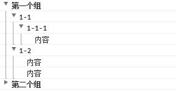
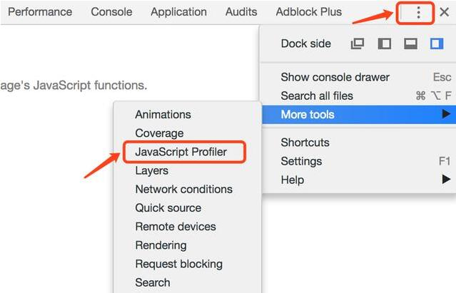
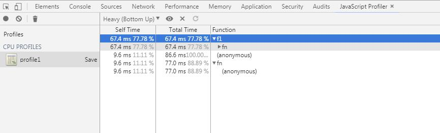

console打印

## 不同类型输出：

console.log('文字信息')
console.info('提示信息')
console.warn('警告信息')
console.error('错误信息')

## 使用占位符

在输出信息时可以通过%占位符来指定对应的值，而不用总是采用拼接字符串的方法。支持的占位符包括以下几种。 

-  %s - 字符
-  %d - 整数
-  %f - 浮点数
-  %o - 对象
-  %c- 定义css样式

## 分组输出：

通过console.group()方法可以以分组的形式展示出信息，类似于列表结构。group()需要使用groupEnd()来结尾包裹分组内容；  groupCollapsed()可以用于代替group()生成折叠的分组。


```
console.group('第一个组');
    console.group("1-1");
        console.group("1-1-1");
            console.log('内容');
        console.groupEnd();
    console.groupEnd();
    console.group("1-2");
        console.log('内容');
        console.log('内容');
    console.groupEnd();
console.groupEnd();

console.groupCollapsed('第二个组');
    console.group("2-1");
    console.groupEnd();
    console.group("2-2");
    console.groupEnd();
console.groupEnd();
```

效果如下：



## 表达式判断：

使用console.assert()方法来判断第一个参数是否为真，false的话抛出异常并且在控制台输出相应信息。

```
console.assert(true);
console.assert(1,false);
console.assert(1===2);//报错VM525:1 Assertion failed: console.assert
```

前两条语句判断结果都为true，所以没有输出任何信息，第三条语句判断结果为false，所以会直接抛出异常。

## 表格输出：

使用console.table()可以将传入的对象，或数组以表格形式输出，适合排列整齐的元素；

```
var Arr = [
    [1,2,3],
    [4,5,6],
    [7,8,9],
]
console.table(Arr);
```

## 计时计算：
一般统计一段代码执行耗时，方法会是通过Date对象获取毫秒数，然后将两个毫秒数进行相减。 除了Date以外在控制台中我们可以通过使用console.time()和console.timeEnd()方法来统计代码段的执行耗。

```
console.time("这段代码");
var arr=[];
for(var i = 0; i < 1000; i++){
	arr.push(i);
}
console.timeEnd("这段代码");//这段代码: 0.275146484375ms
```

注意：使用Console.time()和Console.timeEnd()包裹需要计时的代码片段，其中time()和timeEnd()中的参数必须是一致（即相同字符串），否则会出现0ms的情况。


## 函数调用栈信息
console.trace()方法可以展示出函数调用栈的信息，来查看函数调用过程，一般会选择将这个方法放在最后执行的函数的方法体中。

```
function add(a, b) {
    console.trace("Add");
    return a + b;
}
function f1(a, b) {
    return add(a, b);
}
function f2(a, b) {
    return f1(a, b);
}
var x =f2(1, 1);
```

打印效果如下：

```
VM218:2 Add
add @ VM218:2
f1 @ VM218:6
f2 @ VM218:9
(anonymous) @ VM218:11
```

## 性能分析：
通过console.profile()和console.profileEnd()方法，可以展示出代码中各个函数执行所消耗的时间，可以用来评估代码性能。 

```
function f1(){
	for(var j=0;j<100;j++){
	}
}
function fn(){
	for(var i=0;i<1000;i++){
		f1();
	}
}
console.profile('profile1');
fn()
console.profileEnd();
```

打开chrome浏览器的控制台会有一个Javascript Profile菜单栏，如果默认情况下没有的话，可以按照以下方法打开。

打开这个菜单选项后，我们可以看出每个方法执行消耗的时间。 如下：


## 对象和节点的查看：

使用Console.dir()显示一个对象的所有属性和方法，在Chrome中Console.dir()和Console.log()效果相同。

使用Console.dirxml()显示一个对象的所有属性和方法，在Chrome中Console.dirxml()和Console.log()效果相同。