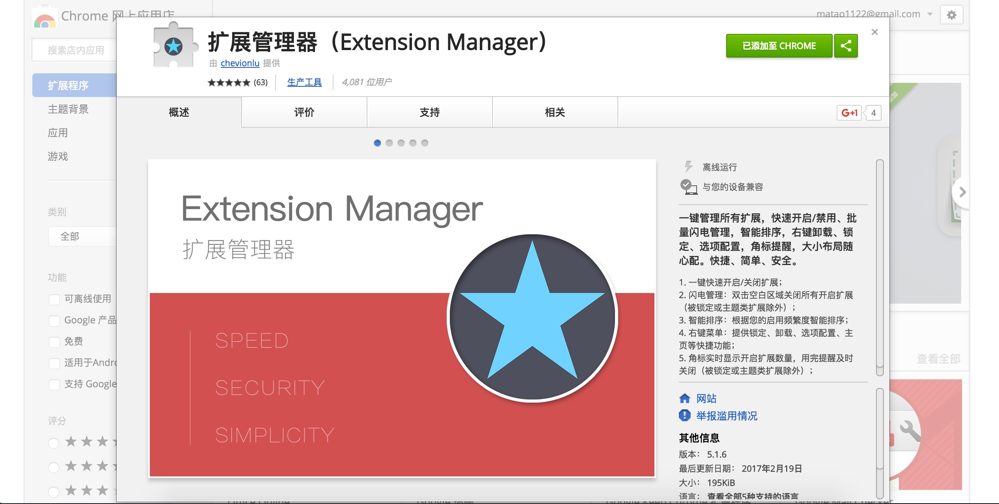

## LastPass

LastPass，全球知名在线密码管理工具之一，采用军事级加密算法，有它，用户仅需记住应用的一个主密码，以上烦恼全解决！此外，应用支持自动填充网站用户名和密码，与朋友分享登录信息等实用功能。还有哦，LastPass 现在全平台同步已经免费啦，无需订阅 Premium，即可在手机、网页、电脑端同步你的所有 LastPass 信息。

## Adblock Plus
## Instapaper

全球两大稍后阅读神器之一 (另外一款为 Pocket)，自从被 Pinterest 收购后，Instapaper 所有高级订阅功能完全免费，令人称道！

当你对某个网页内容感兴趣，却没时间马上阅读，点击 Instapaper 图标或使用快捷键 (Cmd+Shift+S)，一键保存至 Instapaper，方便你随时随地进行查看。

## Better History

自带历史记录，没有任何条理性，乱！乱！乱！只到遇到了它，一种忽如一夜春风来，千树万树梨花开的心情。使用插件后，历史记录将随时间线进行呈现。

## OneTab
大家有木有经常开 10 个以上的标签页经历呢？更痛苦的是，有太多的标签页时，Chrome 有卡顿现象出现！赶紧试试 OneTab，不仅节省高达 95% 的内存，还能减轻标签页混乱现象！单击 OneTab 图标，所有标签页转换成一个列表。当你需要再次访问标签页时，可以单独或全部恢复它们。

## Infinity 新标签页

## 扩展管理器

---